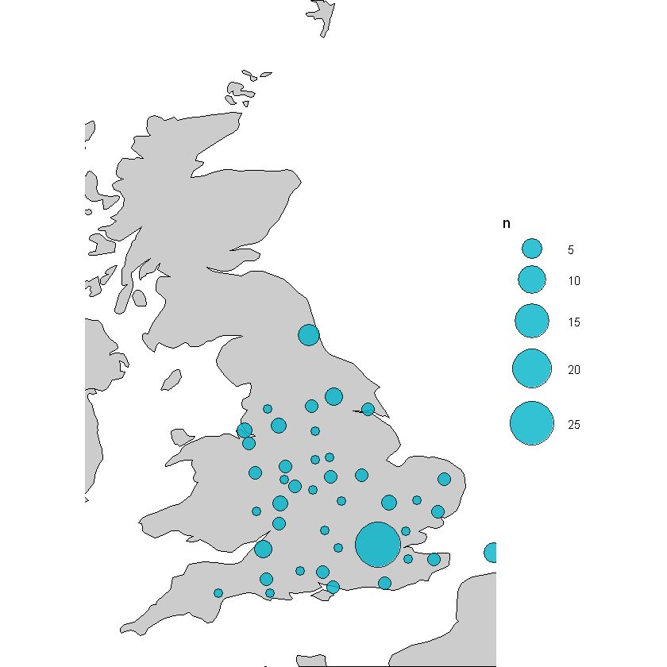
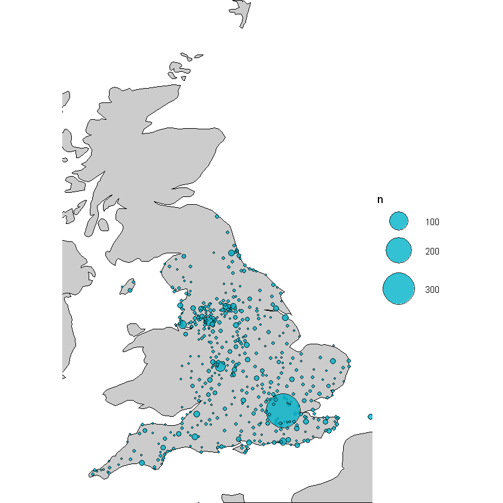
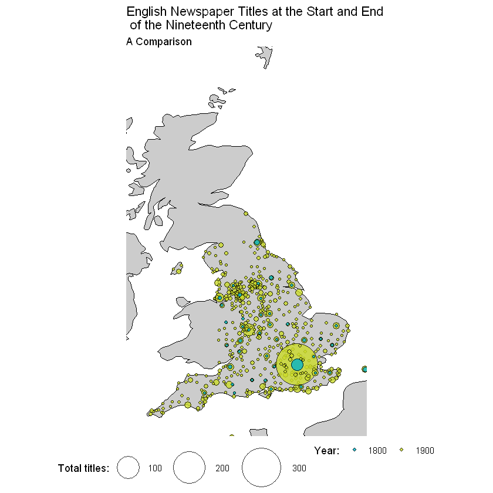

# Mapping the Library's Newspaper Collection
## Where are our titles from? How does it change over time?

### What is this document?

Taking a leaf out of Tim Sheratt's book and explaining what a notebook is... 

This is a markdown file, made from a [Jupyter notebook](https://jupyter.org/). A jupyter notebook is usually an interactive document which can contain code, images and text, and a markdown file is a static version of that. Each bit of code runs in a cell, and the output is displayed directly below.

The code I've used is R, which is a language particularly good for data analysis, but another language, Python, is probably used in Jupyter more frequently. If you're going to work in R, I would recommend downloading [R-Studio](https://rstudio.com) to do all your work, which could then be copied-and-pasted over the Jupyter notebook if needed, like I've done here.

There are tonnes of places to get started working with R, Python, Jupyter notebooks and so forth, and we would recommend looking here in the first instance: 

https://programminghistorian.org/

https://software-carpentry.org/


This notebook produces a couple of maps using our newspaper title list.

I'd like to make a map which maps the titles at the beginning of the nineteenth century and compare it to the end.

There's a couple of steps:
* Calculate the total number of titles printed in 1800, and the total number printed in 1900.
* Join the location information to a dataset of coordinates
* Draw a map of the UK
* Fill in points for 1800 and 1900.

The first step is actually a bit tricky - we have start and end dates in the dataset, not ranges. If we add up all the start dates for 1800, we'll just get the number of titles which were _first_ published in 1800. We want the total number of titles which were published _across_ 1800.

One solution is to make a new dataset which has one row, per title, per year. Then we can isolate a single year, and count every title printed. For that we'll use data.table: another really useful and fast R library.


```R
library(tidyverse)
library(data.table)
library(readxl)
```

Load the list:


```R
working_list <- read_excel(
  "UK_Ireland_Newspapers_Title_Level_List.xlsx", 
                           sheet = "Title-level list")
```

Make the columns a bit easier to read using a library called snakecase:


```R
library(snakecase)
colnames(working_list) = to_snake_case(colnames(working_list))
```

The following makes the dataset we need, first making sure the first and last dates held are converted into numeric form:


```R
working_list$first_date_held = as.numeric(working_list$first_date_held)

working_list$last_date_held = as.numeric(working_list$last_date_held)

long_title_list = setDT(working_list %>% filter(!is.na(first_date_held)) %>% 
                                  filter(!is.na(last_date_held)))[,.(year=first_date_held:last_date_held),by = c("nid",
"title_id",
"publication_title",
"country_of_publication",
"general_area_of_coverage",
"coverage_city",
"first_date_held",
"last_date_held",
"nlp",
"online_status")]
```


```R
glimpse(long_title_list)
```

    Observations: 268,465
    Variables: 11
    $ nid                      <chr> "0033383", "0033383", "0000077", "0000077"...
    $ title_id                 <chr> "014878835", "014878835", "007738797", "00...
    $ publication_title        <chr> "Clapham, Balham, Tooting guardian|Guardia...
    $ country_of_publication   <chr> "England", "England", "England", "England"...
    $ general_area_of_coverage <chr> "Balham (London, England)|Tooting (London,...
    $ coverage_city            <chr> "Clapham (London, England)", "Clapham (Lon...
    $ first_date_held          <dbl> 2007, 2007, 1985, 1985, 1985, 1985, 1985, ...
    $ last_date_held           <dbl> 2008, 2008, 2016, 2016, 2016, 2016, 2016, ...
    $ nlp                      <chr> NA, NA, NA, NA, NA, NA, NA, NA, NA, NA, NA...
    $ online_status            <chr> NA, NA, NA, NA, NA, NA, NA, NA, NA, NA, NA...
    $ year                     <int> 2007, 2008, 1985, 1986, 1987, 1988, 1989, ...
    

Now using some coordinates which were prepared by researchers on the Living with Machines project. Unfortunately we can't share this data for now but you can use an off-the-shelf geocoder such as Geopy or OpenRefine to achieve something similar.


```R
load('coordinates') # load in an .Rdata file which contains the dataframe of coordinates.
```


```R
colnames(coords) = to_snake_case(colnames(coords))
```


```R
long_title_list %>% left_join(coords) %>% glimpse()
```

    Joining, by = c("country_of_publication", "general_area_of_coverage", "coverage_city")
    

    Observations: 268,465
    Variables: 14
    $ nid                      <chr> "0033383", "0033383", "0000077", "0000077"...
    $ title_id                 <chr> "014878835", "014878835", "007738797", "00...
    $ publication_title        <chr> "Clapham, Balham, Tooting guardian|Guardia...
    $ country_of_publication   <chr> "England", "England", "England", "England"...
    $ general_area_of_coverage <chr> "Balham (London, England)|Tooting (London,...
    $ coverage_city            <chr> "Clapham (London, England)", "Clapham (Lon...
    $ first_date_held          <dbl> 2007, 2007, 1985, 1985, 1985, 1985, 1985, ...
    $ last_date_held           <dbl> 2008, 2008, 2016, 2016, 2016, 2016, 2016, ...
    $ nlp                      <chr> NA, NA, NA, NA, NA, NA, NA, NA, NA, NA, NA...
    $ online_status            <chr> NA, NA, NA, NA, NA, NA, NA, NA, NA, NA, NA...
    $ year                     <int> 2007, 2008, 1985, 1986, 1987, 1988, 1989, ...
    $ lng                      <dbl> NA, NA, NA, NA, NA, NA, NA, NA, NA, NA, NA...
    $ lat                      <dbl> NA, NA, NA, NA, NA, NA, NA, NA, NA, NA, NA...
    $ place                    <chr> NA, NA, NA, NA, NA, NA, NA, NA, NA, NA, NA...
    


```R
How many titles overall in 1800?
```


    Error in parse(text = x, srcfile = src): <text>:1:5: unexpected symbol
    1: How many
            ^
    Traceback:
    


```R
long_title_list %>% left_join(coords) %>%
filter(year == 1800) %>% 
filter(country_of_publication == 'England') %>%
group_by(place) %>% 
tally() %>%
ungroup() %>%
arrange(desc(n)) %>% 
head(10)
```

    Joining, by = c("country_of_publication", "general_area_of_coverage", "coverage_city")
    


<table>
<thead><tr><th scope=col>place</th><th scope=col>n</th></tr></thead>
<tbody>
	<tr><td>London             </td><td>27                 </td></tr>
	<tr><td>Newcastle_upon_Tyne</td><td> 6                 </td></tr>
	<tr><td>UNKNOWN            </td><td> 5                 </td></tr>
	<tr><td>Bristol            </td><td> 4                 </td></tr>
	<tr><td>York               </td><td> 4                 </td></tr>
	<tr><td>Cambridge          </td><td> 3                 </td></tr>
	<tr><td>Liverpool          </td><td> 3                 </td></tr>
	<tr><td>Manchester         </td><td> 3                 </td></tr>
	<tr><td>Worcester          </td><td> 3                 </td></tr>
	<tr><td>Birmingham         </td><td> 2                 </td></tr>
</tbody>
</table>


And 1900?


```R
long_title_list %>% left_join(coords) %>%
filter(year == 1900) %>% 
filter(country_of_publication == 'England') %>%
group_by(place) %>% 
tally() %>%
ungroup() %>%
arrange(desc(n)) %>% 
head(10)
```

    Joining, by = c("country_of_publication", "general_area_of_coverage", "coverage_city")
    


<table>
<thead><tr><th scope=col>place</th><th scope=col>n</th></tr></thead>
<tbody>
	<tr><td>London    </td><td>347       </td></tr>
	<tr><td>Birmingham</td><td> 32       </td></tr>
	<tr><td>UNKNOWN   </td><td> 23       </td></tr>
	<tr><td>Manchester</td><td> 20       </td></tr>
	<tr><td>Liverpool </td><td> 17       </td></tr>
	<tr><td>Brighton  </td><td> 14       </td></tr>
	<tr><td>Bristol   </td><td> 11       </td></tr>
	<tr><td>Leeds     </td><td> 11       </td></tr>
	<tr><td>Yeovil    </td><td> 11       </td></tr>
	<tr><td>Bradford  </td><td> 10       </td></tr>
</tbody>
</table>


The first thing I notice is that the top ten go from including old Medieval cities (Bristol, York) to the new industrialised ones (Birmingham and Manchester)

Now to map it. We'll use a library called mapdata:


```R
library(mapdata)
map = map_data('world')
```


```R
Draw a map of Great Britain:
```


    Error in parse(text = x, srcfile = src): <text>:1:6: unexpected symbol
    1: Draw a
             ^
    Traceback:
    


```R
ggplot() + 
geom_polygon(data = map, aes(x = long, y = lat, group = group), fill = 'gray70', color = 'black') + 
coord_fixed(1.3, xlim = c(-6, 2), ylim = c(50, 60)) + 
theme_void()
```


```R
Add the titles from 1800:
```


    Error in parse(text = x, srcfile = src): <text>:1:5: unexpected symbol
    1: Add the
            ^
    Traceback:
    


```R
ggplot() + 
geom_polygon(data = map, aes(x = long, y = lat, group = group), fill = 'gray80', color = 'black') + 
coord_fixed(1.3, xlim = c(-6, 2), ylim = c(50, 60)) +
geom_point(data = long_title_list %>% left_join(coords) %>%
filter(year == 1800) %>% 
filter(country_of_publication == 'England') %>%
group_by(place, lat, lng) %>% 
tally(), aes(x = lng, y = lat, size = n), 
           pch = 21, 
           fill = "#00B3C9", 
           color = 'black',
          alpha = .8) + 
theme_void() + scale_size_area(max_size = 16)
```

    Joining, by = c("country_of_publication", "general_area_of_coverage", "coverage_city")
    





And from 1900:


```R
ggplot() + 
geom_polygon(data = map, aes(x = long, y = lat, group = group), fill = 'gray80', color = 'black') + 
coord_fixed(1.3, xlim = c(-6, 2), ylim = c(50, 60)) +
geom_point(data = long_title_list %>% left_join(coords) %>%
filter(year == 1900) %>% 
filter(country_of_publication == 'England') %>%
group_by(place, lat, lng) %>% 
tally(), aes(x = lng, y = lat, size = n), 
           pch = 21, 
           fill = "#00B3C9", 
           color = 'black',
          alpha = .8) + 
theme_void() + scale_size_area(max_size = 16)
```

    Joining, by = c("country_of_publication", "general_area_of_coverage", "coverage_city")
    Warning message:
    "Removed 2 rows containing missing values (geom_point)."





The growth of regional and local papers is pretty obvious from these maps. Perhaps we could map them both on one to get a better idea of the comparison:


```R
ggplot() + 
geom_polygon(data = map, aes(x = long, y = lat, group = group), fill = 'gray80', color = 'black') + 
coord_fixed(1.3, xlim = c(-6, 2), ylim = c(50, 60)) +
geom_point(data = long_title_list %>% left_join(coords) %>%
filter(year %in% c(1800, 1900)) %>% 
filter(country_of_publication == 'England') %>%
group_by(year,place, lat, lng) %>% 
tally() %>%
           arrange(desc(year)), aes(x = lng, y = lat, size = n, fill = factor(year, levels = c(1800, 1900))),
          alpha = .8,
          pch = 21,
          stroke = .3) +
theme_void() + 
scale_size_area(max_size = 20) + 
scale_fill_manual(values = c("#00B3C9", "#CBDB2A", "#803F92", "#FAA61A", "#FAA61A", "#E1058C")) + labs(fill="Year:", size = 'Total titles:') +
theme(legend.position = 'bottom') + 
ggtitle("English Newspaper Titles at the Start and End\n of the Nineteenth Century", subtitle = "A Comparison")
```

    Joining, by = c("country_of_publication", "general_area_of_coverage", "coverage_city")
    Warning message:
    "Removed 2 rows containing missing values (geom_point)."





```R

```
